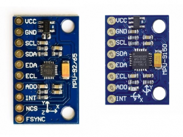
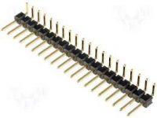
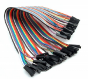
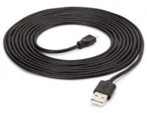
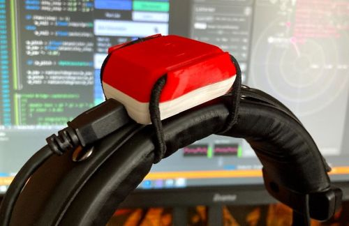
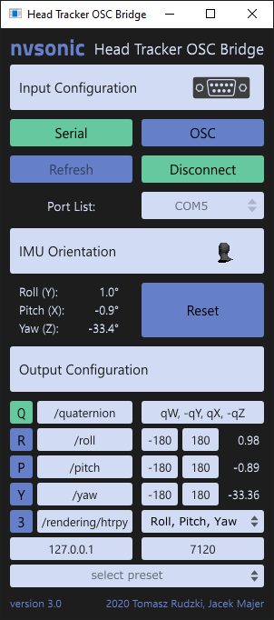
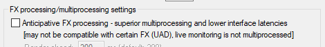

# nvsonic Head Tracker


## nvsonic Head Tracker is a low-cost solution for spatial audio monitoring using headphones
Head tracking is a key element of headphone based spatial audio. Virtual Reality headsets use built-in cameras and inertial sensors to track user’s head movements. For those who would like to experience spatial sound without wearing a VR headset, we have designed a DIY head tracker that can be easily attached to a standard pair of headphones. The total cost of required components does not exceed $20.

With nvsonic Head Tracker users can monitor audio produced with spatial audio plugins, 3D game engines and other software providing realtime audio spatialization. More information on the software compatibility can be found under the OSC Bridge software section.

## Required Components
- MPU-9250 or MPU-9150 orientation sensor (IMU)
- Arduino Pro Micro board
- Gold pin connectors, wires and a Micro USB cable







You can source the necessary components from different vendors, eg. looking on eBay:
- [MPU-9250](http://www.ebay.com/sch/?_nkw=MPU-9250)
- [MPU-9150](http://www.ebay.com/sch/?_nkw=MPU-9150)
- [Arduino Pro Micro with ATmega32U4 microcontroller](http://www.ebay.com/sch/i.html?_nkw=Arduino+Pro+Micro+ATmega32U4)

## Assembling the Head Tracker
Connect the IMU sensor with Arduino board according to the diagram shown below.


## RJ Lab 3D Printed Enclosure
Thanks to Rémi Janot the head tracker can be mounted in this neat 3D printed enclosure. Check out his [Facebook page](https://www.facebook.com/RJ-Lab-110388251245900) or contact him directly (remi-janot@outlook.fr) if you're interested in one.




## Flashing Arduino
- Connect the assembled Head Tracker to your computer using a Micro USB cable.
- Clone / download this repository.
- Open the Arduino [sketch](head-tracker-arduino/head-tracker-arduino.ino) in [Arduino IDE](https://www.arduino.cc/en/Main/Software). Choose 'Leonardo Arduino Board' in Tools menu as well as the COM port associated with the Arduino board.
- Compile and upload the sketch to your device.

## Attaching to Headphones
Attach the sensor at the top of the headband, centered. The wires should be oriented towards left ear side. The Arduino board can be attached to the side of the headband. You can use zip ties or velcro straps to fix the parts in place. Use your creativity:)


## Orientation Data
The estimated orientation data is sent by the Arduino board using serial protocol. The data stream can be observed using Serial Monitor in Arduino IDE. Here is an example:
```0.6035,-0.5409, 0.3667,-0.4568; 0.6035,-0.5409, 0.3667,-0.4568; 0.6035,-0.5409, 0.3668,-0.4567;```

Commas separate [quaternion](https://en.wikipedia.org/wiki/Conversion_between_quaternions_and_Euler_angles) values (Qw, Qx, Qy, Qz) and semicolons are used to separate data frames. The refernce orientation of X, Y and Z axes is pictured below. The dot on the chip is located in the same corner as the VCC pin on the board.


## Orientation Estimation Performance
You can experience some drift during the first minute of operation. Give it some time, most likely the sensor needs to stabilize its temperature to provide an accurate orientation reading as well as perform some autocalibration routines. Unfortunately, there is a small percentage of faulty MPU boards. If you can't get a stable orientation reading, the best bet is to try another unit.

# nvsonic OSC HT Bridge software
After assembling the device use the nvsonic OSC Bridge app to control spatial audio software. The latest release can be found on the [Releases](https://github.com/trsonic/nvsonic-head-tracker/releases) page.



You may also want to compile the app yourself after downloading the [JUCE](https://juce.com/get-juce/download) framework, setting up your preferred development environment and cloning this repository.

## Compatible Software
The OSC HT Bridge app can control a wide range of spatial audio plugins as well as other interactive software tools thanks to its customizable tracking data output format. The predefined OSC output configurations are stored in the [presets.xml](head-tracker-osc-bridge/Resources/presets.xml) file. This file can be edited in order to add your own presets. It should be located in the same directory as the app.

The following software tools can be controlled using the presets provided with the OSC HT Bridge app:
- [Matthias Kronlachner's ambix_rotator](http://www.matthiaskronlachner.com/?p=2015)
- [IEM SceneRotator](https://plugins.iem.at/)
- [SPARTA AmbiBIN and Rotator](http://research.spa.aalto.fi/projects/sparta_vsts/plugins.html)
- [AudioLab SALTE](https://github.com/AudioLabYork/SALTE-audio-renderer)
- [Noise Makers Ambi Head HD](https://www.noisemakers.fr/ambi-head-hd/)
- [Unity](https://unity.com/)
- [3D Tune-In Toolkit](https://github.com/3DTune-In/3dti_AudioToolkit)
- [SSA aXRotate](https://www.ssa-plugins.com/product/axrotate/)
- [Mach1 Monitor](https://www.mach1.tech/spatial-system#monitor)

## Compatibility with Other Head Trackers
The OSC HT Bridge can be used with other tracking systems. We provide an experimetal support for the [OHTI Headtracker](https://github.com/bossesand/OHTI). It can be connected with the Bridge using both serial (over USB) or OSC (over Wifi) communication. This feature will be extended to more devices in the future.

## Head Tracking in Reaper
### Latency
To minimize the tracking latency turn off anticipative FX processing in Reaper's preferences.



### Plugin Control
OSC messages sent by the Bridge app can be used to control different plugin parameters in Reaper thanks to its “learn” functionality. Toggle “M” (mute) buttons in the Bridge to control which parameter is being sent, then pick the destination parameter in Reaper. Sending only one parameter at a time (Roll, Pitch or Yaw) is required for this process. This may be useful for controling apps which don't provide OSC input, eg. [Facebook 360 Spatial Workstation](https://facebook360.fb.com/spatial-workstation/) Control plugin. Also have a look at the tutorial posted by [Gabriel Zalles](https://github.com/gzalles/) at the [NYU Immersive Audio Group blog](https://wp.nyu.edu/immersiveaudiogroup/2018/01/26/nvsonic-headtracker-nyu/).

## Project Authors
- [Tomasz Rudzki](https://github.com/trsonic/) - PhD Student at [AudioLab](https://audiolab.york.ac.uk/), University of York, UK
- Jacek Majer - PhD Student at Warsaw University of Technology, Poland

The Arduino code is based on the following project: https://github.com/rpicopter/ArduinoMotionSensorExample

Also thanks to Rémi Janot and Charles Verron for their contribution!
